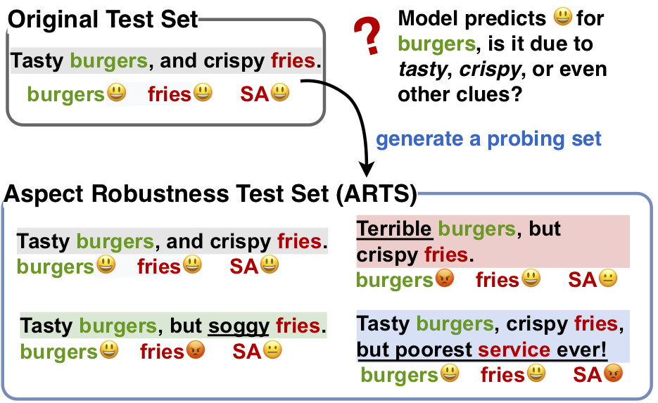

This is the repository for our 2020 paper 
"[**Tasty Burgers, Soggy Fries: Probing Aspect Robustness in Aspect-Based Sentiment Analysis**](http://zhijing-jin.com/files/papers/absa2020.pdf)".

## Data
We provide a **Aspect Robustness Probing** test set for [SemEval 2014](http://alt.qcri.org/semeval2014/task4/) Aspect-Based Sentiment Analysis (ABSA).
- Our new enriched test sets are at [data/arts_testset](data/arts_testset/)

### Data Generation Process

We generate our new probing test set by **three automatic strategies**: 
- <span style="color:blue">RevTgt (red)</span>: Reverse the sentiment of the Target aspect.
- <span style="color:blue">RevNon (green)</span>: Reverse the sentiment of the Non-target aspect.
- <span style="color:blue">AddDiff (blue)</span>: Add new aspects with Different sentiment.




## How to Use Our Code
If you have a **new** ABSA dataset, you can run our code to generate you own **aspect robustness probing** test set.
```
python code/main.py -dataset_name laptop
``` 

## More Questions
If you have more questions, please feel free to submit a [GitHub issue](https://github.com/zhijing-jin/ARTS_testset/issues).


 
