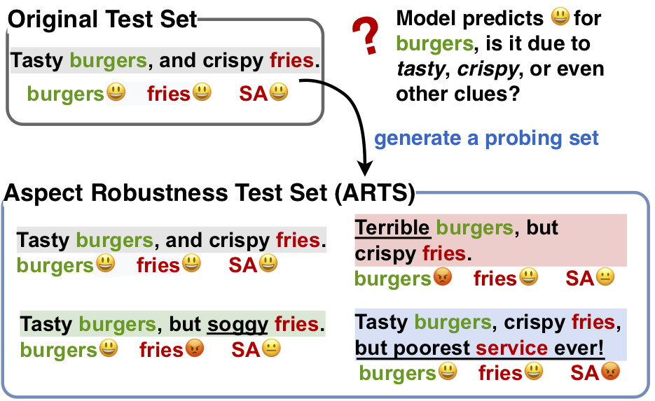

This is the repository for our paper 
"[**Tasty Burgers, Soggy Fries: Probing Aspect Robustness in Aspect-Based Sentiment Analysis**](https://arxiv.org/pdf/2009.07964)" **(EMNLP 2020)**.

Authors: [Xiaoyu Xing](https://scholar.google.ru/citations?user=gC7UghIAAAAJ&hl=en)\*, [Zhijing Jin](https://zhijing-jin.com)\*, [Di Jin](https://jind11.github.io/), [Bingning Wang](https://bingning.wang/research/aboutme), [Qi Zhang](http://qizhang.info/), and [Xuanjing Huang](https://xuanjing-huang.github.io/).

## Data

We provide a **Aspect Robustness Probing** test set for [SemEval 2014](http://alt.qcri.org/semeval2014/task4/) Aspect-Based Sentiment Analysis (ABSA).

- Our new enriched test sets are at [data/arts_testset](data/arts_testset/)
- Our `AspectSet` mentioned in the paper Section 2.3 (Table 4) is provided in [data/aspectset](data/aspectset/)


### Data Generation Process

We generate our new probing test set by **three automatic strategies**: 

- <span style="color:blue">RevTgt (sentence with a red background)</span>: Reverse the sentiment of the Target aspect.
- <span style="color:blue">RevNon (sentence with a green background)</span>: Reverse the sentiment of the Non-target aspect.
- <span style="color:blue">AddDiff (sentence with a blue background)</span>: Add new aspects with Different sentiment.




### Aspect Probing Results

We probed nine ABSA models (as mentioned in our paper). 

- Their outputs on SemEval 2014 are in the [output](output) folder.

## How to Use Our Code

If you have a **new** ABSA dataset, you can run our code to generate you own **aspect robustness probing** test set.

```
python code/main.py -dataset_name laptop
```

### Dependencies

- Version of allennlp package: You can install allennlp-2.5.0 with the Predictor https://s3-us-west-2.amazonaws.com/allennlp/models/elmo-constituency-parser-2020.02.10.tar.gz

### All Trained Models

If needed, see a dump of all the trained models and output files on [Edmond](https://edmond.mpg.de/) titled `Supplementary Model Files for "Tasty Burgers, Soggy Fries: Probing Aspect Robustness in Aspect-Based Sentiment Analysis"`.

## More Questions

If you have more questions, please feel free to submit a [GitHub issue]([issues](https://github.com/zhijing-jin/ARTS_testset/issues)https://github.com/zhijing-jin/ARTS_testset/issues).

